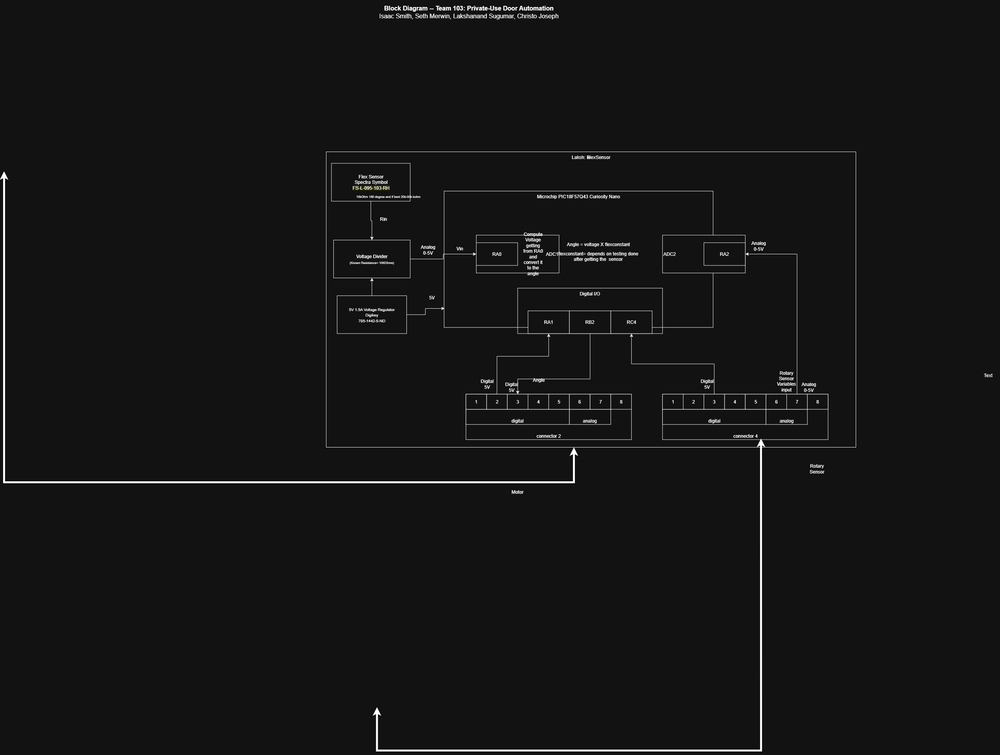

## Overview

This subsystem is responsible for reading data from a flex sensor and communicating with the motor subsystem to control movement based on the sensor’s readings. All components within this subsystem are powered through a 5 V voltage regulator, which is supplied by a 9 V input, as shown by the dashed box in the diagram.

The Microchip PIC18F57Q43 Curiosity Nano acts as the main controller, handling the analog input from the flex sensor and sending digital control signals to other subsystems.

To get some initial formatting help, one can view ["here"](https://embedded-systems-design.github.io/EGR304DataSheetTemplate/Appendix/basic-markdown-examples/) some basic techniques.

## Component Overview

1. Flex Sensor (FSR402)

   Positioned on the left side of the diagram.

   This sensor detects bending or pressure changes.

   Its output passes through a voltage divider to bring the signal into the 0–5 V analog range.

   This analog signal is fed into the RA0 (AN0) analog input pin on the microcontroller.

2. Voltage Regulator (7805)

   Converts 9 V input into a stable 5 V supply.

   Powers both the flex sensor circuitry and the microcontroller.

3. Microchip PIC18F57Q43 Curiosity Nano

   Located at the center of the diagram.

   Processes the analog signal from the flex sensor (RA0/AN0).

   Uses RA1, RB2, and RC4 pins to send digital output signals to the motor subsystem through connectors.

   These signals determine whether the motor should start, continue, or stop.

4. Connectors

   Connector 2: Carries the flex sensor’s analog signal into the controller and digital outputs back to other parts of the system.

   Connector 4: Shown in the diagram to indicate signals received from another subsystem’s rotary sensor — not part of this subsystem. This labeling clarifies that the microcontroller receives rotary data externally, but the rotary sensor hardware is implemented elsewhere.

5. Motor Interface

   Located at the bottom of the diagram.

   This subsystem sends digital control signals to the motor subsystem.

   These signals are generated based on the flex sensor’s readings and are used to coordinate motor movement.

## Signal Flow

1. Input:

   Analog from Flex Sensor → RA0 (AN0)

2. Outputs:

   Digital control signals via RA1, RB2, RC4 → Motor Subsystem

## Subsystem Role

The Flex Sensor Subsystem plays the role of a sensor-driven control unit. It constantly monitors the flex sensor’s readings, processes the analog signal, and uses that information to decide what commands to send to the motor.

The rotary sensor signals shown on the right are external inputs from another subsystem, not part of this subsystem’s hardware. They are included in the diagram purely to illustrate how this subsystem interfaces with others in the overall system.

