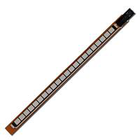
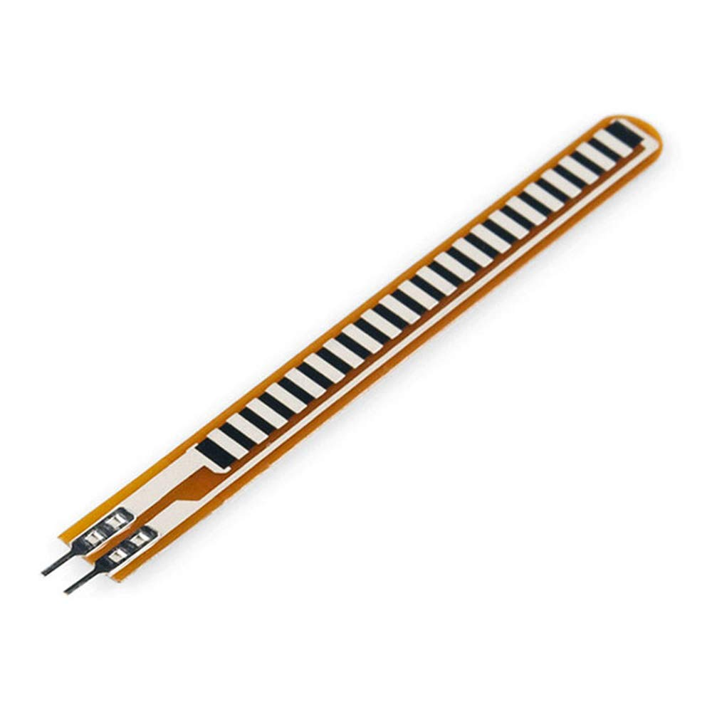
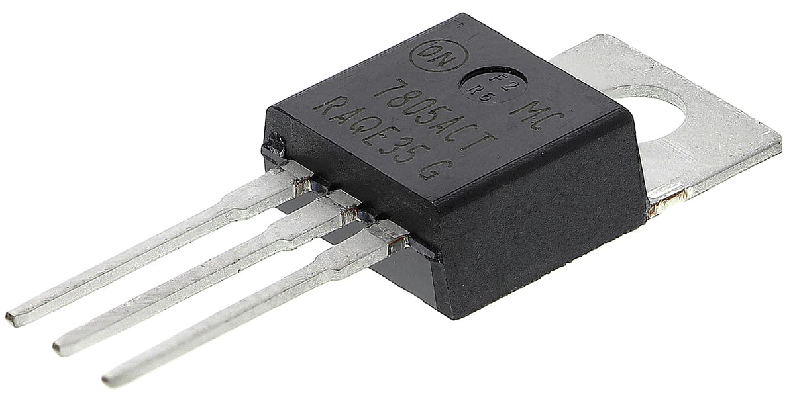
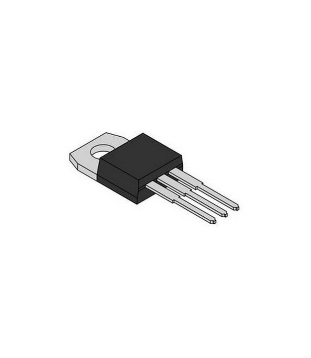
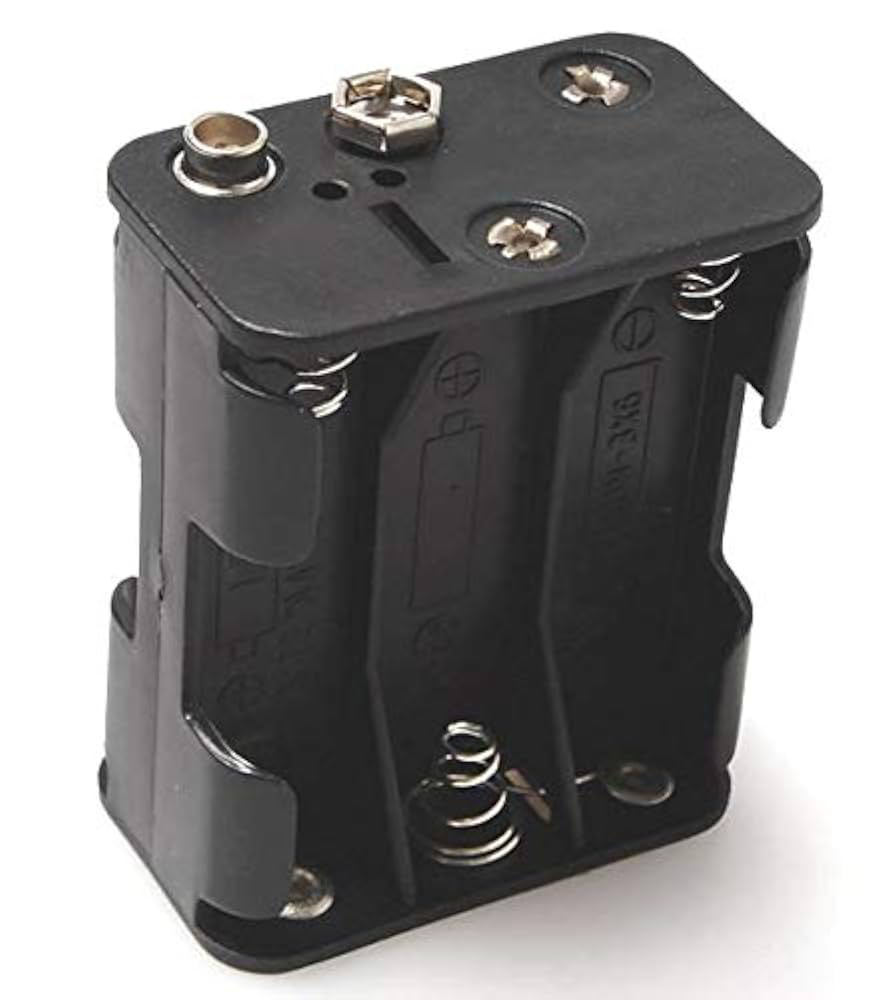
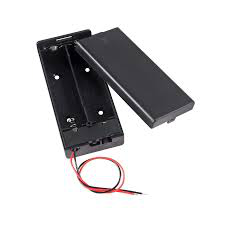

> **Scope (Laksh / Flex Sensor Subsystem):**
> Flex Sensor,
> Signal-Conditioning/Voltage Divider,
> 5 V Regulator, External Power Source,
> Connectors used by this subsystem, and
> Short Microcontroller comparison.

> **Interfaces:**
> Outputs digital lines **RA1, RB2, RC4** to the Motor subsystem via Connector 2. Optional rotary analog signal arrives on **RA2/AN2** from a different subsystem (shown for context only).

## Pin Table

| Function                       | PIC Pin       | Notes                                  |
| ------------------------------ | ------------- | -------------------------------------- |
| Flex sensor ADC                | **RA0 / AN0** | Divider output 0–5 V                   |
| Rotary sensor ADC _(external)_ | **RA2 / AN2** | From Rotary subsystem (interface only) |
| Motor control 1 (digital out)  | **RA1**       | To Motor subsystem via Connector 2     |
| Motor control 2 (digital out)  | **RB2**       | 〃                                     |
| Motor control 3 (digital out)  | **RC4**       | 〃                                     |

---

## Block: Flex Sensor

**Role:** Measures bend angle; resistance increases with bend. Routed through a divider to 0–5 V for the ADC.

| Solution                                                    | Photo                                                                |     Cost | Link                                                                                                        | Pros                                                                                  | Cons                                                               |
| ----------------------------------------------------------- | -------------------------------------------------------------------- | -------: | ----------------------------------------------------------------------------------------------------------- | ------------------------------------------------------------------------------------- | ------------------------------------------------------------------ |
| **Option 1:** Spectra Symbol FS-L-095-103-RH (95 mm, 10 kΩ) |                      | ~$16–$20 | [Digi-Key product page](https://www.digikey.com/en/products/detail/spectra-symbol/FS-L-095-103-RH/17051203) | • Stock 10 kΩ • Clear datasheet & ordering guide • “RH” solder tab option             | • ±30% R tolerance • Needs tail strain relief                      |
| **Option 2:** Spectra Symbol FS-L-060-103 (60 mm)           |  | ~$15–$18 | [Mouser FS-L-060-103](https://www.mouser.com/ProductDetail/Spectra-Symbol/FS-L-060-103)                     | • Shorter length for tight spaces • Same 10 kΩ nominal • Similar calibration behavior | • Smaller absolute ADC swing for same bend                         |
| **Option 3:** Flexpoint Bend Sensor (10 kΩ class)           |                 | ~$10–$20 | [Mouser bend sensors](https://www.mouser.com/c/sensors/position-sensors/flex-bend-sensors/)                 | • Alternative vendor/lead times • Multiple formats/lengths                            | • Different mechanical stack-up; re-characterization may be needed |

**Choice:**
**FS-L-095-103-RH** (95 mm, 10 kΩ)  
[FS-L-095-103-RH](../image/fs-l-095-103-rh.png)

**Rationale:** Fits the mechanical reach and provides a large, clean ADC span with a simple divider. It’s well-documented and readily available in class-friendly quantities.

---

## Block: Signal-Conditioning / Voltage Divider

**Role:** Convert the flex sensor’s resistance change to a 0–5 V signal for **RA0/AN0**; optionally filter/buffer.

| Solution                                                          | Photo                                           |         Cost | Link                                                                                                                                                                                            | Pros                                                                               | Cons                                                                 |
| ----------------------------------------------------------------- | ----------------------------------------------- | -----------: | ----------------------------------------------------------------------------------------------------------------------------------------------------------------------------------------------- | ---------------------------------------------------------------------------------- | -------------------------------------------------------------------- |
| **Option 1:** Simple divider (10 kΩ sensor vs fixed Rin 10–22 kΩ) |  |       <$0.10 | [Voltage divider (ref)](https://en.wikipedia.org/wiki/Voltage_divider)                                                                                                                          | • Minimal BOM • Works straight into ADC                                            | • Source impedance varies → sampling error • No anti-alias filtering |
| **Option 2:** Divider + RC low-pass (e.g., 1 kΩ + 0.1 µF)         |      |       <$0.20 | [RC low-pass (ref)](https://en.wikipedia.org/wiki/Low-pass_filter#RC_filter)                                                                                                                    | • Noise reduction • Stabilizes readings • Limits aliasing                          | • Adds latency; cutoff must be chosen                                |
| **Option 3:** Buffer with rail-to-rail op-amp (MCP6002)           |                 | ~$0.40–$0.80 | [MCP6002 product](https://www.microchip.com/en-us/product/mcp6002) · [Datasheet PDF](https://ww1.microchip.com/downloads/en/DeviceDoc/MCP6001-1R-1U-2-4-1-MHz-Low-Power-Op-Amp-DS20001733L.pdf) | • High input Z; isolates ADC • Rail-to-rail @ 5 V • Easy to add active filter/gain | • Slightly higher BOM & layout effort                                |

**Choice:** **Option 2: Divider + RC**, with an upgrade path to **Option 3** if noise or ADC impedance issues are observed.  
**Rationale:** RC filtering stabilizes the measurement with negligible cost/complexity; buffering remains a drop-in improvement if needed.

---

## Block: 5 V Regulator (from 9 V source)

**Role:** Provide regulated 5 V to the Curiosity Nano + sensor chain.

| Solution                                              | Photo                                        |   Cost | Link                                                                                                                     | Pros                                                   | Cons                                      |
| ----------------------------------------------------- | -------------------------------------------- | -----: | ------------------------------------------------------------------------------------------------------------------------ | ------------------------------------------------------ | ----------------------------------------- |
| **Option 1:** onsemi MC7805ACTG (TO-220, 5 V / 1.5 A) |        |    ~$1 | [Digi-Key MC7805ACTG](https://www.digikey.com/en/products/detail/onsemi/MC7805ACTG/919998)                               | • Simple & robust • Easy to heatsink • Low EMI         | • Linear → heat from 9→5 V at higher I    |
| **Option 2:** TI LM2940-5.0 (TO-220, ~1 A)            |         | ~$2–$3 | [TI LM2940 product page](https://www.ti.com/product/LM2940)                                                              | • Lower dropout than 7805 • Good line/load behavior    | • Still linear (heat) • ~1 A limit        |
| **Option 3:** LM2596 buck module (5 V, up to ~3 A)    |  | ~$3–$6 | [LM2596 module (Addicore)](https://www.addicore.com/products/lm2596-step-down-adjustable-dc-dc-switching-buck-converter) | • High efficiency • Low heat • Higher current headroom | • Module height; EMI care/layout practice |

**Choice:** **MC7805ACTG**
[MC7805ACTG](../image/mc7805actg.png) for the current subsystem load;
I would switch to **LM2596** if total current rises.

**Rationale:** For Nano + sensor (<~150 mA worst-case), a 7805 is the quietest, lowest-risk choice. If future peripherals raise current or thermal budget, the buck module avoids dissipation.

**Thermal note:** \( P*{\text{diss}} = (9\ \text{V} - 5\ \text{V}) \times I*{\text{total}} \).  
_Example:_ at 120 mA → \(0.48\ \text{W}\) (fine on TO-220 with airflow). Add a small heatsink if \(>0.8\ \text{W}\).

---

## Block: External Power Source (feeds the 5 V rail)

| Solution                                                   | Photo                                          |             Cost | Link                                                                                                       | Pros                                                      | Cons                                          |
| ---------------------------------------------------------- | ---------------------------------------------- | ---------------: | ---------------------------------------------------------------------------------------------------------- | --------------------------------------------------------- | --------------------------------------------- |
| **Option 1: 9 V wall adapter, 2.1 mm barrel (center +)**   |          |          ~$8–$12 | [CUI DPD series datasheet](https://resources.ampheo.com/static/datasheets/cui-inc/dpd090050-p5p-tk.pdf)    | • Clean, regulated • Plug-and-play • No charging concerns | • Tethered to mains                           |
| **Option 2: 6×AA holder (9 V alkaline / ~7.2 V NiMH)**     |        |           ~$1–$3 | [DFRobot 6×AA holder](https://www.dfrobot.com/product-201.html)                                            | • Cheap, simple • Field-portable                          | • Requires cells/charger • V droop under load |
| **Option 3: 2×18650 holder (7.4 V nominal) + buck to 5 V** |  | ~$2–$5 (+ cells) | [Parts-Express 2×18650 holder](https://www.parts-express.com/18650-Dual-Battery-Holder-with-Leads-140-781) | • High energy density • Reusable cells                    | • Li-ion safety/charging management           |

**Choice:** **9 V wall adapter**
[9V adapter](../image/adapter-9v.png)
for bench bring-up; consider **2×18650 + buck** for mobile demos later.

**Rationale:** The adapter minimizes risk and simplifies testing; battery paths add charging/cutoff complexity not needed for MVP.

---

## Block: Connectors (sensor input + subsystem headers)

| Solution                                            | Photo                                                  |     Cost | Link                                                                                              | Pros                                                 | Cons                              |
| --------------------------------------------------- | ------------------------------------------------------ | -------: | ------------------------------------------------------------------------------------------------- | ---------------------------------------------------- | --------------------------------- |
| **Option 1:** JST-XH (2.5 mm pitch) wire-to-board   |                          |      Low | [JST XH datasheet](https://www.jst-mfg.com/product/pdf/eng/eXH.pdf)                               | • Locking friction • ~3 A (AWG22) • Widely available | • Not breadboard-friendly         |
| **Option 2:** Molex/JST-XH assortment kit           |                      |  $20–$30 | [Adafruit JST-XH kit (PDF)](https://www.mouser.com/datasheet/2/737/Adafruit_4423_Web-3357984.pdf) | • Handy assortment for lab builds                    | • Bulk purchase; storage overhead |
| **Option 3:** 0.1″ (2.54 mm) pin headers + housings |  | Very low | [Adafruit 0.1″ break-away header](https://www.adafruit.com/product/400)                           | • Breadboard-compatible • Lowest cost                | • No latch; can pull loose        |

**Choice:** **JST-XH**
[JST-XH](../image/jst-xh.png)
on the PCB for field connections; **0.1″ headers** for bench adapters.

**Rationale:** XH gives retention and current capacity on-device; 0.1″ is convenient during prototyping.

---

## Microcontroller (short comparison — required by checklist)

| Solution                                          | Photo                                                  |     Cost | Link                                                                                   | Pros                                               | Cons                                           |
| ------------------------------------------------- | ------------------------------------------------------ | -------: | -------------------------------------------------------------------------------------- | -------------------------------------------------- | ---------------------------------------------- |
| **PIC18F57Q43 Curiosity Nano (Dev Board)**        |       | ~$25–$35 | [Microchip DM164150](https://www.microchip.com/en-us/development-tool/DM164150)        | • On-board debugger • Fast bring-up • Known pinout | • Larger footprint • Dev-board BOM cost        |
| **Bare PIC18F57Q43 on custom PCB**                |  |   ~$3–$6 | [PIC18F57Q43 product](https://www.microchip.com/en-us/product/PIC18F57Q43)             | • Lowest per-unit cost • Small footprint           | • Needs programming/debug HW • Longer bring-up |
| **Alt MCU Dev Board (ATmega4809 Curiosity Nano)** |                 | ~$25–$30 | [ATmega4809 Curiosity Nano](https://www.microchip.com/en-us/development-tool/EV35L43A) | • Similar toolchain • Many examples                | • Porting effort • Different peripherals       |

**Choice:** **PIC18F57Q43 Curiosity Nano**
[Curiosity Nano](../image/pic18f57q43-nano.webp)
**Rationale:** Lowest risk and fastest path for this course: on-board debugger, USB power, and immediate access to RA0/RA2 (ADC) + RA1/RB2/RC4 (digital outs). Provided in class

---
