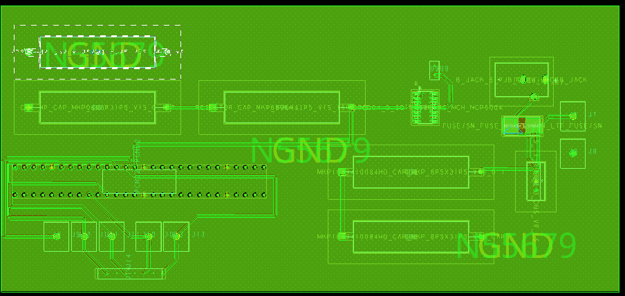

---

title: PCB Layout

**Description:**  
The PCB layout includes a two-layer design (top and bottom copper), with clear routing for power and sensor signals. Mounting holes and connector pads are positioned for easy assembly.

**Layer Previews (from Cadence PCB Editor):**

##The Zip folder of the project can be downloaded by . **[Cliking here](Individual_Subsystem.zip)**
