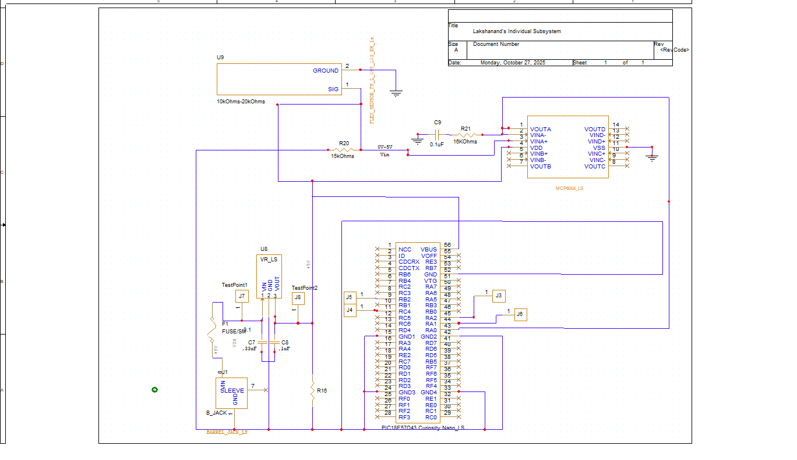

**Schematic**

The schematic shows all connections for the PIC18F57Q43 Curiosity Nano, power regulation, sensor input, and interface headers.  
Bypass capacitors (0.1 µF) are placed near each VDD pin. The regulator receives 9–12 V from an external adapter and provides a clean 5 V rail to the board.

The PDF of the schematic can be downloaded by . **[Cliking here] (final.pdf)**

---

## Schematic Files (Final Design)

- **Rasterized schematic image (PNG/JPG):** `Capture.png` (shown above)
- **High-resolution schematic PDF:** [Download schematic PDF](final.pdf)
- **Schematic ECAD project (.zip):** [Download schematic ECAD project](schematic_ecad.zip)
