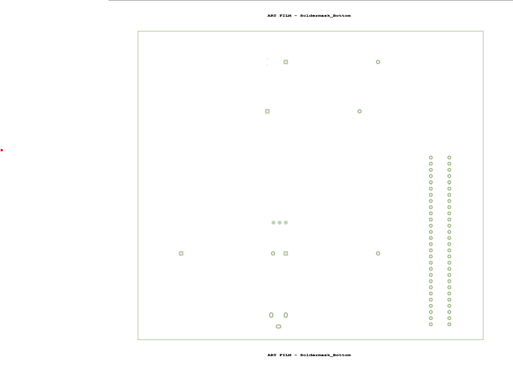
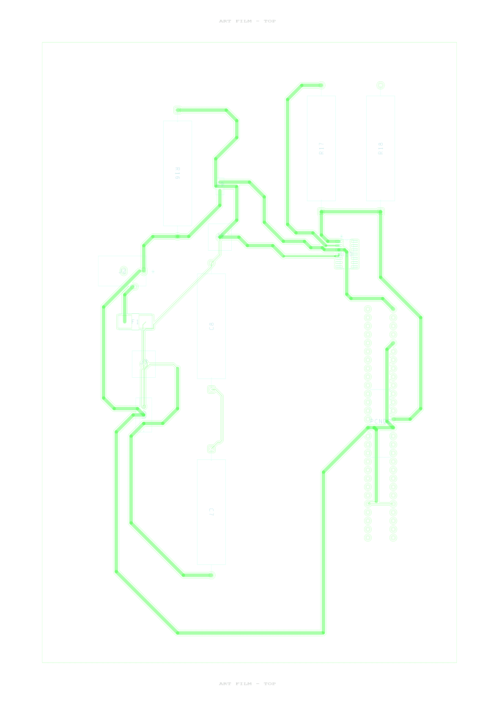

> **Scope (Laksh / Flex Sensor Subsystem):**
> This schematic represents the individual subsystem containing the Curiosity Nano microcontroller, 5 V linear regulator, Flex Sensor voltage divider, and necessary connectors for power and communication.

---

## 🧩 Schematic

**Overview:**  
The schematic shows all connections for the PIC18F57Q43 Curiosity Nano, power regulation, sensor input, and interface headers.  
Bypass capacitors (0.1 µF) are placed near each VDD pin. The regulator receives 9–12 V from an external adapter and provides a clean 5 V rail to the board.

📦 **[Download Full Project ZIP — Individual_Subsystem.zip](Individual_Subsystem.zip)**

---

## 🪛 PCB Layout & Layers

**Description:**  
The PCB layout includes a two-layer design (top and bottom copper), with clear routing for power and sensor signals. Mounting holes and connector pads are positioned for easy assembly.

**Layer Previews (from Cadence PCB Editor):**

|           View           |              Image               |
| :----------------------: | :------------------------------: |
| **Full Board Overview**  |     |
|    **Top Soldermask**    |     |
|  **Bottom Soldermask**   |  |
|    **Bottom Copper**     |      |
| **Top Copper / Outline** |         |
| **Full Board Overview**  |     |

📦 **[Download PCB + Schematic Files (ZIP)](Individual_Subsystem.zip)**

## ✍ Author

**Lakshanand Sugumar**  
B.S.E. Robotics Engineering, Arizona State University  
_EGR 304 — Individual Subsystem (Flex Sensor)_  
📅 Submitted October 20, 2025
