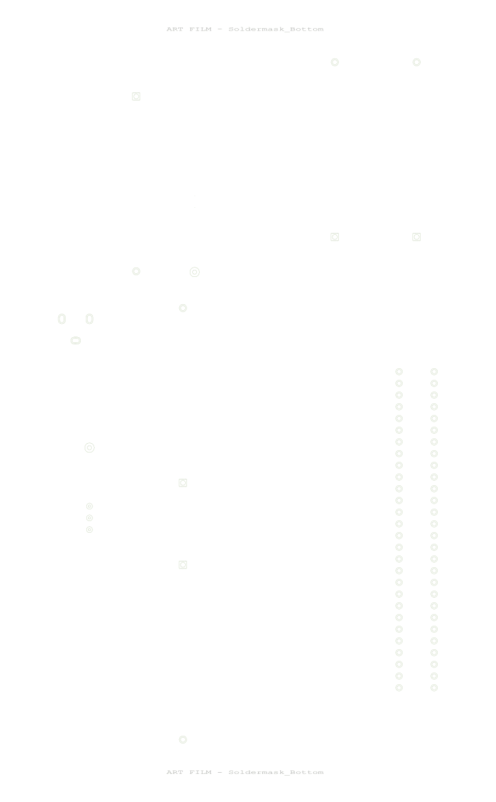

# 🧠 Overview

This schematic represents the **individual subsystem** designed by **Lakshanand Sugumar** for the Embedded Systems Design course.  
It integrates a **PIC18F57Q43 Curiosity Nano** with a **5V linear voltage regulator**, **sensor circuit**, and **header connections** for interfacing with the main team system.

The design focuses on:

- Stable 5V regulation from a 9–12V barrel jack input
- Safe current-limited power using an inline fuse
- Analog signal conditioning for the sensor (amplified + filtered)
- Proper bypass capacitors and power decoupling
- UART headers for serial data communication
- Debug LED and resistors for MCU feedback

---

# ⚙️ Schematic

  
   
  <em>Figure 1 – Individual subsystem schematic showing Curiosity Nano, voltage regulation, and analog sensor interface.</em>

---

# 🪛 PCB Layout & Layers

### Top Copper Layer

### Soldermask Views

  
  

### Outline & Bottom Copper

  
  

---

# 📦 Resources

| File                                         | Description                                               |
| -------------------------------------------- | --------------------------------------------------------- |
| [ExampleSchematic.pdf](ExampleSchematic.pdf) | Full schematic PDF                                        |
| [dummyZip.zip](dummyZip.zip)                 | Zipped Cadence/KiCad project (symbols, footprints, board) |

---

# 🧩 Component Summary

|   Ref   | Component                   | Description                    |
| :-----: | :-------------------------- | :----------------------------- |
|   U8    | 5V Linear Regulator (VR_LS) | Converts 9–12V input to 5V     |
|   U9    | Amplified Sensor            | Analog signal conditioning     |
|   J5    | Curiosity Nano LS           | Main MCU interface             |
|   Q1    | Diode                       | Reverse polarity protection    |
| R16–R18 | Resistors                   | Bias and current limiting      |
|  C7–C8  | Capacitors                  | Bypass and filtering           |
|  J3–J6  | Headers                     | UART, sensor, and power output |

---

# ✅ Verification

✔️ **ERC / DRC Passed** – no open nets or rule violations  
✔️ **Custom symbols include initials “LS”**  
✔️ **Proper decoupling capacitors** on all power pins  
✔️ **Ground return path and clearance verified**

---

# ✍️ Author

**Lakshanand Sugumar**  
B.S.E. Robotics Engineering, Arizona State University  
_Embedded Systems Design – Individual Subsystem_  
📅 _Submitted: October 20, 2025_
