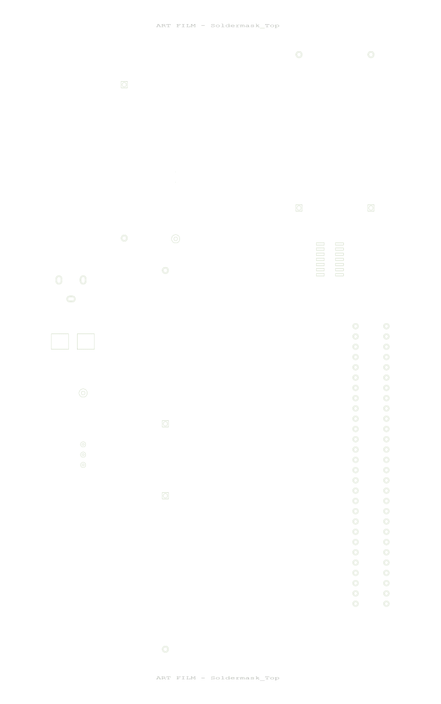

---

title: 🪛 PCB Layout & Layers

**Description:**  
The PCB layout includes a two-layer design (top and bottom copper), with clear routing for power and sensor signals. Mounting holes and connector pads are positioned for easy assembly.

**Layer Previews (from Cadence PCB Editor):**

|           View           |              Image               |
| :----------------------: | :------------------------------: |
| **Full Board Overview**  |     |
|    **Top Soldermask**    |     |
|  **Bottom Soldermask**   |  |
|    **Bottom Copper**     |      |
| **Top Copper / Outline** |         |
| **Full Board Overview**  |     |

## 📦 **[Download PCB + Schematic Files (ZIP)](Individual_Subsystem.zip)**
