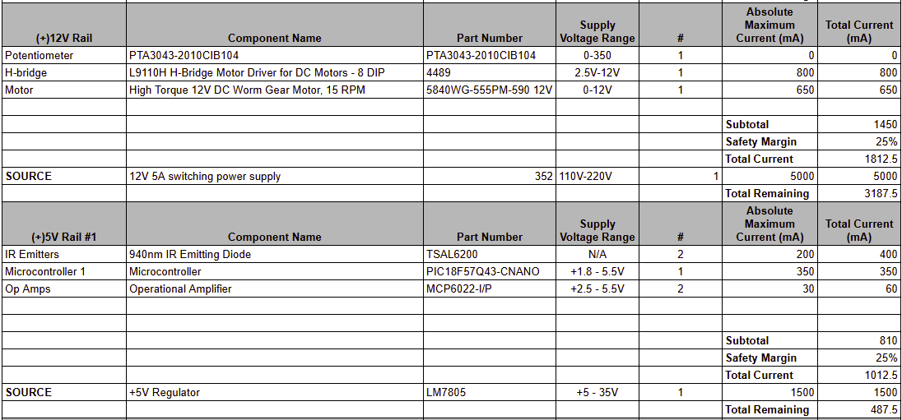

## Overview
This page presents the power budget for all major components across the four subsystems of the automatic door opener. The power budget was developed to estimate the maximum possible current draw from each major electrical component and to outline how power is distributed and supplied throughout the system. This analysis ensures that all power sources and voltage regulators are properly rated to deliver the required current to each subsystem without risk of overloading or power failure.

> Capture your power budge as a image to display. Take time to get clean breaks and a well organized layout.

{style width:"350" height:"300;"}

Conclusions

Based on the prepared Power Budget, the subsystem operates well within a safe and reasonable current range, leaving additional capacity that can be utilized by other subsystems if needed. The team’s combined power budget analysis confirms that even with a 25% increase in total estimated current draw, the system still maintains sufficient power headroom to ensure stable and reliable operation across all components.

Resources

Power Budget (PNG):  [*here*](power.png)

Power Budget (Excel Sheet): [*here*](PowerBudget.xlsx).