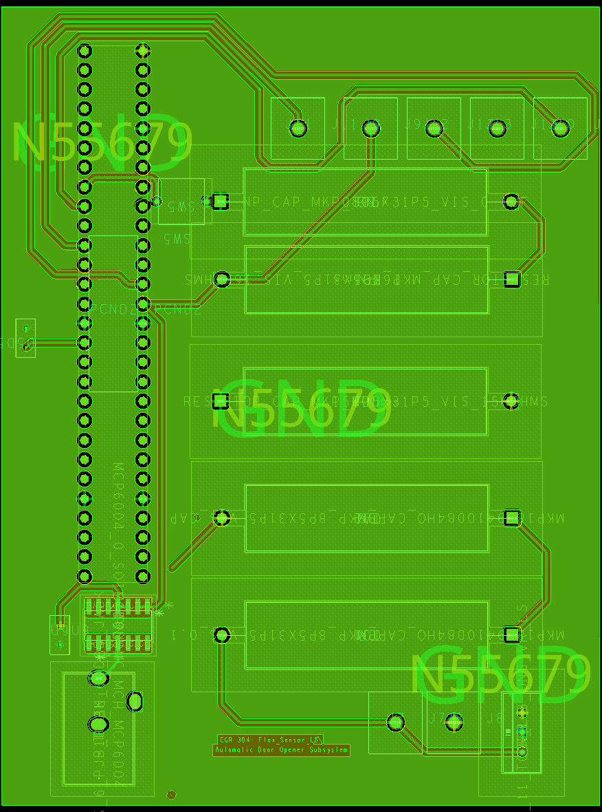

**PCB DESIGN**

The PCB layout includes a two-layer design (top and bottom copper), with clear routing for power and sensor signals. Mounting holes and connector pads are positioned for easy assembly. Top layer is N55768 which is supplied with +5v and bottom layer is connected to ground.

The PDF of the board can be downloaded by . **[Cliking here](finalpcb.pdf)**
Gerber Files can be download by **[Cliking here](project.zip.zip)**

---

## ECAD PCB Design (Front/Back)

The ECAD image above (`schem6.png`) shows the final routed PCB, including both the top and bottom copper layers. It represents the final board outline, mounting holes, component footprints, and power/signal routing for the flex sensor subsystem.

If needed, separate ECAD views (top and bottom only) can also be exported from the ECAD tool and added here, but `schem6.png` is the primary ECAD view for this design.

---

## Fabricated PCB — Assembled (Real Board Photos)

The following images are photographs of the **real, fabricated PCB** after assembly and soldering. These satisfy the requirement for final PCB photos, front and back, after population and testing.

**Assembled PCB Front (real board)**

**Assembled PCB Back (real board)**

The assembled board was verified for:

- Correct 5 V regulation from the external supply
- Proper routing of the flex sensor signal into the ADC
- Correct operation of the LED indicator and debug switch
- Continuity and absence of unintended shorts on power and ground planes

---

## ECAD and Gerber Archives (Final Submission)

For manufacturing and reproducibility, the final ECAD design files and Gerber outputs are provided as ZIP archives in this repository.

- **Final ECAD Project (.zip):** [Download ECAD Project](ecad.zip)
- **Final Gerber Files (.zip):** [Download Gerber Files](gerber.zip)
